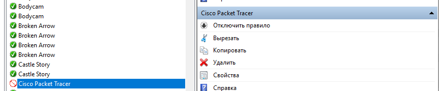

# Домашнее задание: блокировка Cisco Packet Tracer в брандмауэре

**Студент:** Абдуллаев Билол  
**Группа:** РПО 3

## Задание

Заблокировать Cisco Packet Tracer в брандмауэре Windows.

## Выполнение

В брандмауэре Windows создано правило для исходящего подключения, блокирующее Cisco Packet Tracer.

## Скриншот

