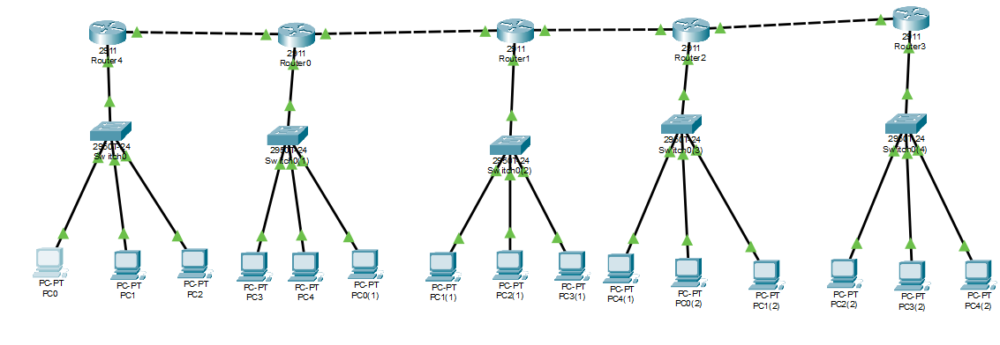
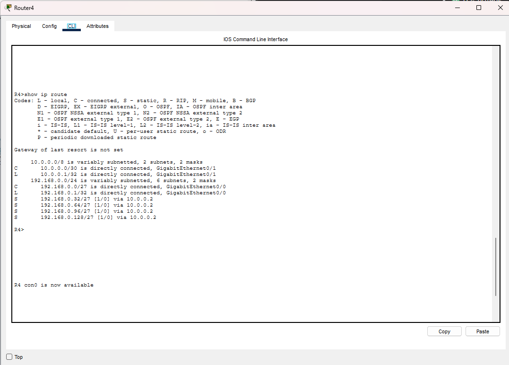
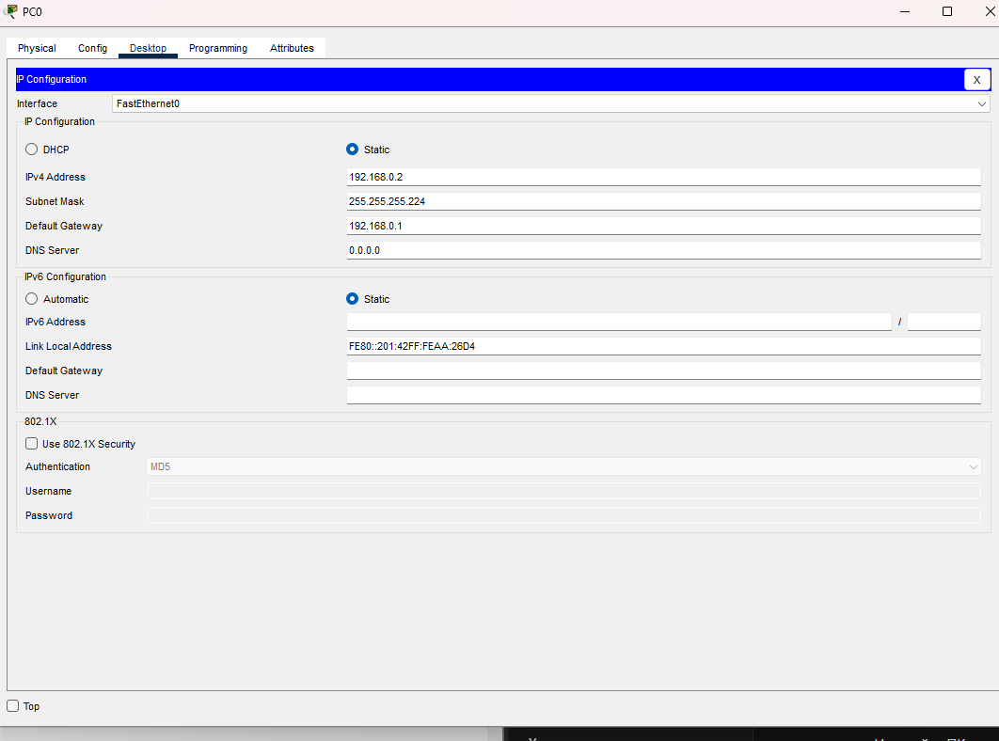

# Урок 4. IPv4 и адресация

**Тема:** Адресация IPv4. Разбиение сети на подсети  
**Студент:** Абдуллаев Билол  
**Группа:** РПО 3  
**Преподаватель:** Рачинкин Ярослав Алексеевич

## 1. Расчёт подсетей для 5 зданий

Исходная сеть: `192.168.0.0/24`.  
Нужно: 5 зданий × 15–25 устройств.

Для 25 узлов: 2^n − 2 ≥ 25 → n = 5 бит (30 узлов).  
Под подсети остаётся 3 бита → 8 подсетей.

**Маска: /27 (255.255.255.224)**

| Здание | Подсеть | Шлюз | Диапазон хостов |
|---|---|---|---|
| 1 | 192.168.0.0/27 | 192.168.0.1 | 192.168.0.2 – 192.168.0.30 |
| 2 | 192.168.0.32/27 | 192.168.0.33 | 192.168.0.34 – 192.168.0.62 |
| 3 | 192.168.0.64/27 | 192.168.0.65 | 192.168.0.66 – 192.168.0.94 |
| 4 | 192.168.0.96/27 | 192.168.0.97 | 192.168.0.98 – 192.168.0.126 |
| 5 | 192.168.0.128/27 | 192.168.0.129 | 192.168.0.130 – 192.168.0.158 |

## 2. Расчёт для 20 подсетей и 10 узлов

**Для 20 подсетей:**  
2^n ≥ 20 → n = 5 → 32 подсети. Остаётся 3 бита (6 узлов).  
**Ответ: /27**

**Для 10 узлов:**  
2^n − 2 ≥ 10 → n = 4 → 14 узлов. Под подсети 4 бита (16 подсетей).  
**Ответ: /28**

**Вывод:** одновременно 20 подсетей и 10 узлов в одной /24 невыполнимы.

## 3. Топология сети

5 зданий соединены последовательно (линейная топология):

Router8 — Router8(1) — Router8(3) — Router8(2) — Router8(4)

**Файл топологии:** `ipv4-subnets.pkt`

## 4. Скриншоты

### Топология сети

### Таблица маршрутизации

### Проверка ping

