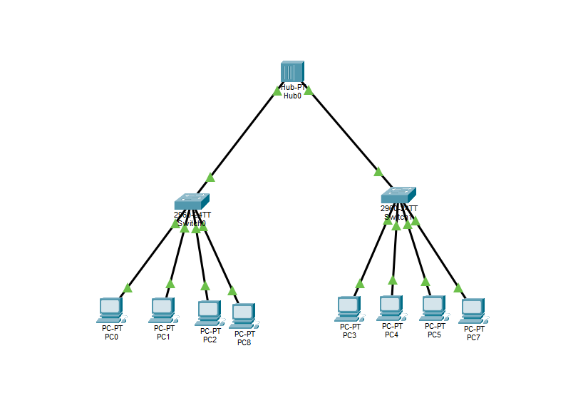
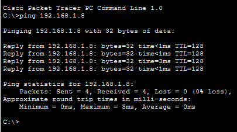
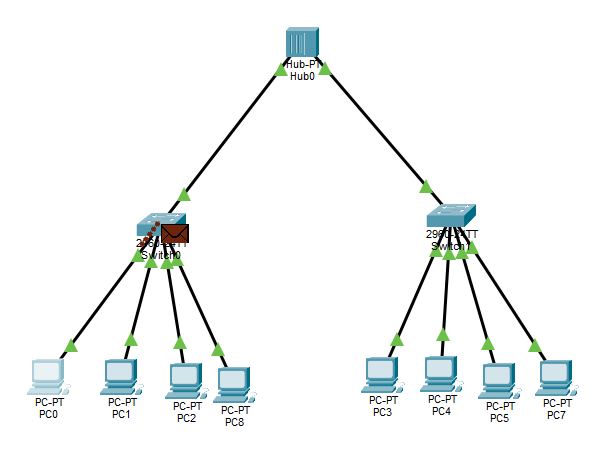

# Домашнее задание: сеть с 2 коммутаторами и хабом

**Студент:** Абдуллаев Билол  
**Группа:** РПО 3

## Задание

Построить сеть в Cisco Packet Tracer:
- 8 компьютеров
- 2 коммутатора
- 1 хаб

Сеть: `192.168.1.0/24`. Все устройства в одной подсети.

## Схема сети

## Проверка ping (консоль)

## Симуляция отправки пакета

**Файл Packet Tracer:** `hub-switch.pkt`
