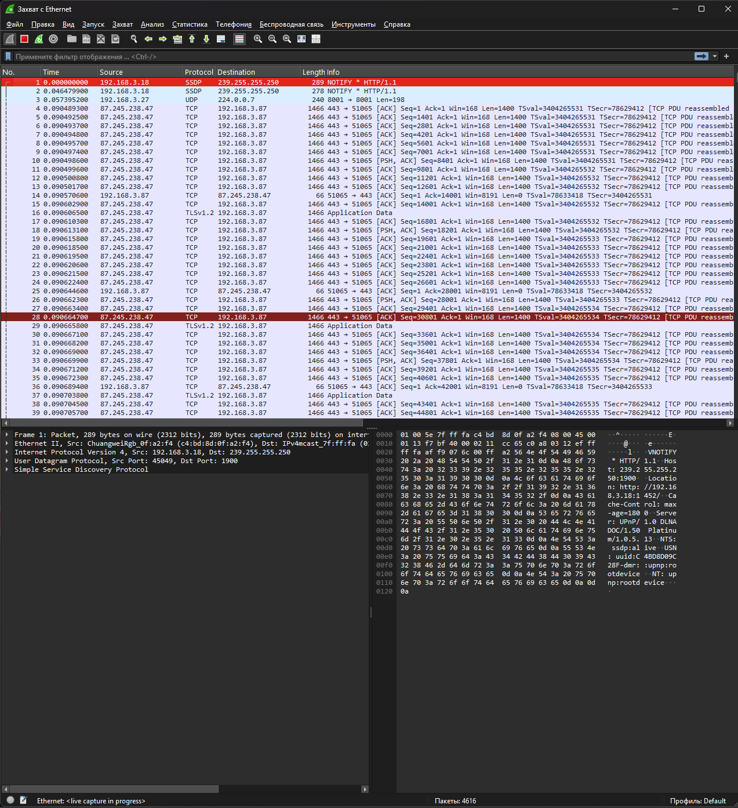

# Модуль 7. Коммутация Ethernet — лабораторная работа

Выполнил: Абдуллаев Билол группа РПО 3 
Дата:10.09.2026

## Задание
Захватить Ethernet-трафик в Wireshark и проанализировать кадр.

## Скриншот

## Анализ кадра
- Номер кадра: 1
- Протокол: SSDP
- Длина: 289 байт
- MAC источника: c4:bd:8d:0f:a2:f4 (unicast)
- MAC назначения: 01:00:5e:7f:ff:fa (multicast)
- Тип EtherType: 0x0800 (IPv4)

## Вывод
В ходе работы освоен захват и анализ кадров Ethernet в Wireshark.
Определены поля заголовка Ethernet II: MAC источника, MAC назначения и тип протокола.